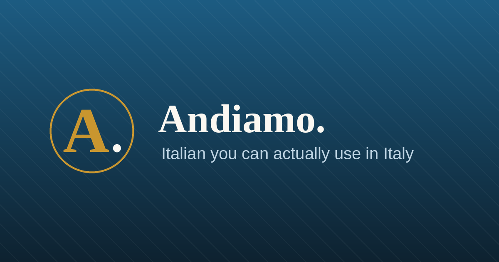

# Andiamo — Italian for travellers

A single-page web app: phrases, verb conjugation, flashcards, matching, and role-play conversations aimed at eating, drinking, travelling and talking to people in Italy. No build step, no dependencies, no server code.

**Live:** https://YOUR-USERNAME.github.io/andiamo/



## Version

**Numbering changed at build 13.** Versions are now a plain count of downloads — 13, then 14, then 15 — instead of the old three-part numbers. The build formerly called 3.7.0 is listed in the app's changelog as *12 (was 3.7.0)*; everything before it keeps its original label.


This build is **23**. The file is named `index-v23-pause-and-back.html` — **rename it to `index.html` before or after uploading**, because GitHub Pages serves `index.html` as the front page. The version sits at the right of the blue bar at the top of every screen — `v23 · 8.31.26`. Once the app has checked GitHub it adds **✓ latest** in green; if a newer build is waiting it turns gold and says **update ready**; with no signal it says **offline**. Tap the stamp any time to check. The Plan page repeats it in full under *This app*, with the publish date and a list of what changed in each build.

## How updating works

`sw.js` fetches the page from the network first, so opening the app on your phone with any signal pulls the newest build straight from GitHub. The cached copy is only used when you're offline. If a new build lands while the app is open, a bar appears at the bottom saying a newer build is ready. **Plan → Check for updates** forces the check by hand and tells you if you're already current.

When you upload a new build, change two numbers so phones know something moved:

1. In `index.html`, near the top of the script: `const BUILD = "23";` — and add a line to the `CHANGES` list describing what you did.
2. In `sw.js`, line 5: `const BUILD = "23";`

Keep them the same. If you forget, the app still updates (HTML is network-first), but the icons and manifest may stay on the old cached copies.

## Files — upload all of these to the repository

| File | What it does |
|---|---|
| `index.html` | The whole app. Rename the versioned file to this. |
| `manifest.webmanifest` | Tells the phone the app's name, colours and icons. |
| `sw.js` | Caches the app so it still works with no signal. |
| `apple-touch-icon.png` | The icon iPhone and iPad use on the home screen. |
| `icon-192.png`, `icon-512.png` | The icons Android uses. |
| `icon-512-maskable.png` | Android version that fills round or squircle icon shapes. |
| `favicon.ico`, `favicon.png` | The little icon in the browser tab. |
| `social-preview.png` | The picture that shows when you text or post the link. |
| `README.md` | This page. GitHub shows it on the repo's front page. It is not part of the app. |

Keep them all in the same folder, at the top level of the repository. Don't rename them — `index.html` refers to each by name.

## Publish it

1. Go to github.com → **New repository**. Name it `andiamo`, set it **Public**, and create it.
2. On the repo page click **Add file → Upload files**, drag in all the files above, then **Commit changes**.
3. **Settings → Pages**. Under *Build and deployment* choose **Source: Deploy from a branch**, **Branch: main**, **Folder: / (root)**. Save.
4. Wait a minute or two, then open `https://YOUR-USERNAME.github.io/andiamo/`.

Optional, for a nicer link preview: **Settings → General → Social preview → Edit → Upload an image** and pick `social-preview.png`.

## Put it on your phone's home screen

Open the Pages link on the phone, then:

- **iPhone / iPad (Safari):** Share button → **Add to Home Screen** → Add. Safari must be the browser; Chrome on iOS can't do this.
- **Android (Chrome):** ⋮ menu → **Add to Home screen** / **Install app**.

You get the gold **A.** icon, it opens full screen with no browser bars, and it keeps working when you have no data. Your streak, saved phrases and card progress live on that device, so your phone and laptop track separately.

## Repeat after me

At the bottom of the blue **Andiamo.** tile on the Today tab, under the streak figures, there are two buttons: **♪ Voice & speed** on the left and **↻ Repeat · off** on the right. Tap the Repeat one and choose 3×, 5× or 10× — it turns gold and reads *↻ Repeat · 5×* so you can see it's on. From any other tab, the small **♪** at the top right of the blue bar opens the same panel. From then on every play button in the app — phrases, dictionary entries, verb forms, story lines, quiz feedback, your own phrases — says the Italian, leaves you a gap the same length to say it back, then says it again. The last time through is slower. The play buttons carry a small gold badge while it's on, so you always know why they're looping.

Every reading is followed by a gap, including a single pass through a list, and there's a gap after the spoken English too. **How long it waits** is its own setting in the same panel — Quick, Normal, Slow, Very slow — and it's also on screen during a hands-free session so you can adjust while practising. The gap is measured against the phrase rather than fixed, so *Ciao* stays brisk and *Sarebbe possibile per dodici persone, stasera?* gets the room it needs. Never shorter than 1.2 seconds, never longer than 12. Changing it plays a sample so you can hear the difference.

For hands-free practice there's **Practice → Repeat after me**, which works through a whole deck on its own with pause, skip and back. The same thing sits on every quick-reference page (*Repeat after me — the whole page*), on every story (line by line), and on your own phrases.

### A whole verb out loud

Open any verb — tap it in **Words**, or on a **Start here** card — and press **Run through this verb out loud**. Before it starts you choose:

- **Forms and examples** (*essere · io sono · Io sono di San Diego · tu sei · Tu sei di Sydney …*, 13 lines) or **Forms only** (*io sono · tu sei · lui è …*, 7 lines)
- **Once** through, like a list, or **3× / 5× / 10×** to drill each line before moving on
- **🔊 Say the English too** — reads the translation after each line in an English voice, so it works with the phone in your pocket
- **↺ Loop the list** — starts again at the top

All four can be changed mid-run from the session screen, along with the pause length.

One limitation worth knowing: phones stop web audio when the screen locks, so keep the screen awake for pocket practice.

## Spoken Italian

The **Voice** button in the top bar cycles through the Italian voices installed on your device and steps the speed down to 0.7×. If nothing plays, add an Italian voice:

- **iPhone:** Settings → Accessibility → Spoken Content → Voices → Italian.
- **Android:** Settings → System → Languages & input → Text-to-speech → install the Italian voice.

## Finding your way around

The **Today** tab is a title card and six bars, all the same size: How to use this app · ★ Start here · Quick reference · My phrases · Start today's 10-minute session · then the day's lesson and the full set of practice drills, each folded into an accordion. Phrase of the day closes the page.

**How to use this app** is a short page — one line per tab, five things worth knowing — with accordions underneath for anyone who wants more: what the personal sheet asks and why, what happens to your answers, moving to another device, formal versus informal, editing generated phrases, and keeping the app up to date. It's also linked at the top of the Plan tab.

## Start here

The big gold button at the top of the **Today** page (also on **Plan**, and the first chip in **Words**) opens a short list: the 16 verbs and roughly 80 words that carry most of a trip. The verbs come with a line on why each one earns its place and their six forms on the card. The words are grouped by the job they do — the first ten words, the five request formulas, question words, keeping a conversation alive, at the table, getting around, numbers and time, when something goes wrong.

Two buttons at the top drill the lot: **Drill the 16 verbs** runs a conjugation session across exactly those, and **Flashcards on the words** turns the 81 essentials into a deck. Both are also available as the ★ Essentials deck in Practice.

## The Words page

A full dictionary of everything the app uses — verbs, nouns, adjectives and the small words that hold sentences together. One button flips it between **Italian → English** and **English → Italian**, there's a search box that looks in both languages, filters for each word type, and an A–Z strip to jump down the list.

Tap any entry and you get the same panel as tapping a word anywhere else: the meaning, the full verb table if it's a verb, and a real sentence from the app showing it in use. Expressions that need a person in front of them are conjugated out in full — look up **hunger** and you get *avere fame*, then ho fame / hai fame / ha fame / abbiamo fame / avete fame / hanno fame with the English beside each.

## Verb tables

Tap any verb — in the Words list, or any conjugated form anywhere in the app — and each of the six persons shows three things: the Italian form, what it means in English, and a worked example with its translation. The example is spoken, and its words are tappable like everything else.

```
io    sono  = I am
      ▶ Io sono di San Diego.   I'm from San Diego.
tu    sei   = you are
      ▶ Tu sei di Sydney.       You're from Sydney.
```

Verbs with two meanings show an example for each: `prendo` gives both *Io prendo il treno delle otto — I take the eight o'clock train* and *Io prendo un caffè al banco — I have a coffee at the counter*, and the label reads `= I take / have`. Eighteen verbs carry a second sense this way.

Verbs that don't work in every person — costare, durare, servire, interessare, colpire — show examples only where a real sentence exists (*Quanto costa il caffè? · Mi colpiscono i colori*).

## Story lessons

**Practice → Stories** holds one restaurant story told seven ways: a couple sharing a tiramisu, then the same story with a craft beer, a dozen oysters, a cheese board, an affogato, a tray of cannoli, and a glass of grappa — swapping husband and wife for a brother and sister, two friends, two colleagues, a father and daughter. The skeleton never changes, so by the third telling you're reading rather than decoding, and the verbs change with the thing being shared: *ne mangia un pezzettino*, *ne beve un sorso*, *ne taglia una fettina*, *ne mangia una*.

Four ways through each one:

- **Read** — the whole story, English hidden until you ask for it, every word tappable
- **Listen** — line by line with the text hidden, replay as often as you like, reveal when you're ready
- **Translate** — the English line, you say the Italian, then check
- **Fill the gaps** — four to eight questions per story

The gap questions target what actually trips people up: *suo* vs *tuo* vs *il suo*, *gli* vs *le* vs *lo* vs *la*, *ne* vs *lo*, *piena* vs *pieno*, *mangialo* vs *mangiali* vs *mangiale*, *ordinerò* vs *ordino* vs *ordinerei*. Every option carries an explanation — not just why the right one is right, but what the sentence would have to be for your wrong answer to become the right one. Choose *tua* and it tells you *tua* would fit if you were speaking to the wife herself.

Story lines also feed the rest of the app: they're a deck in Practice, they show up as example sentences when you tap a word, and they're available to focused practice.

## Drilling one word

Every word pop-up ends with **Practise this word** and four buttons: 10, 20, 30, 50. Pick a length and you get a session built entirely around that word — every sentence in the app that uses it, plus fresh ones generated from patterns, mixed across gap-fills, multiple choice, listening and word order. Tap `quale` and you'll work through *Quale autobus va in centro? · Quale birra mi consiglia? · Quale formaggio è più piccante? · Da quale binario parte?* and so on. If the word is a verb, conjugation questions get folded in too.

Nouns and adjectives generate their own sentences from their entry, so even a word with only one appearance in the app gives you a full session.

## My phrases — your own cheat sheet

**Saved → My phrases** (also a button on Today) opens a six-step sheet: who you are, your family and who's travelling with you, work, what you like, the trip, and the occasion. About 45 questions, nearly all one tap, everything skippable. From your answers the app writes a phrasebook of roughly 60–70 lines in your own words — the question a stranger will ask, then your answer:

> *Che cosa la porta in Italia?* — What brings you to Italy?
> **Siamo qui per il matrimonio di mio nipote Madigan.** — We're here for my nephew Madigan's wedding.

Sections: Chi sono · La mia famiglia · Il mio lavoro · I miei gusti · Il viaggio · L'occasione · Domande da fare. The last one is openers of your own, picked from what you told me — say you like wine and you get *Qual è la cantina migliore della zona?*; say you're here for a wedding and you get *Come conosce gli sposi?*

A toggle switches the whole set between **formal (lei)** and **informal (tu)**. Tap ✎ on any card to reword it — useful for film titles, since *2001: A Space Odyssey* is *2001: Odissea nello spazio* in Italy. Your version is kept. **Practise these** turns your own sentences into a drill deck, which is the part that actually teaches them.

Grammar follows your answers: one question at the start sets whether Italian describes you as masculine or feminine, so you get *sono americano* or *sono americana*, *sposato* or *sposata*, all the way through. Jobs, nationalities, relationships and interests are picklists rather than free text, so they come out as real Italian; names, bands and titles are free text and print as you typed them.

### Describing people

Each person on the travelling-with list is built as a chain: a name, then **is** a bare relationship, then **of** someone, and if you need it, **of** someone again. A line under the row shows what it will say, in both languages, as you build it.

- daughter → *mia figlia* — my daughter
- daughter · of my cousin → *la figlia di mia cugina* — my cousin's daughter
- partner · of my brother → *il compagno di mio fratello* — my brother's partner
- daughter · of my brother-in-law · of his brother → *la figlia del fratello di mio cognato* — my brother-in-law's brother's daughter

For people no chain fits there's a **No link needed** group at the bottom of the first list: a friend of the family, a friend of my parents, a travelling companion, someone from work, my child's in-laws, just a friend, a neighbour.

Every linked person gets their own card with the question attached — *Chi è Dee?* → **Dee è un amico di famiglia.** Anyone with an age gets *E Chiara quanti anni ha?* → **Chiara ha nove anni.**

### Going into more detail

Each step of the sheet shows a short set of questions. Where more depth is available there's a **More detail** button — on the tastes step it opens two long lists, 39 foods and 34 drinks, where each item is tapped to cycle through ♥ love · + like · – not keen · ✕ can't stand · ! allergic · ⏸ not right now. One more tap clears it. Only the ones you mark generate phrases, so you can spend thirty seconds or ten minutes on it.

Marking shellfish as allergic gives you *Sono allergico ai crostacei. È grave.* and *Ci sono i crostacei in questo piatto?*; marking gluten as not-right-now gives *In questo periodo non posso prendere il glutine.*

Other things the sheet handles: **no children** as an explicit answer (yours or ours), people **linked through other people** — a second box on each row turns girlfriend + cousin into *la fidanzata di mio cugino* — **several work situations at once** (student and looking for work and between jobs), several jobs, and a **main reason plus secondary reasons** for the trip.

### The Saved tab

Four bars you open and close, so a quick note doesn't mean scrolling past everything else:

- **My sheet** — which of the six steps are filled in, with an Open button on each that jumps you straight there
- **Your phrases** — your generated phrasebook, itself split into collapsible sections
- **Word list** — words you starred in a pop-up
- **Notes** — write, edit, delete

Coming in from **Today → My phrases** opens straight onto your phrases, since that's what you asked for. Opening the **Saved** tab itself gives you all four bars to choose from.

### Privacy and moving it to another device

Nothing is sent anywhere — the app has no server. **Download a backup**, at the bottom of the Saved tab, writes one `.json` to your downloads holding everything personal: your sheet answers, any phrases you reworded, your notes, your saved words and starred phrases, your streak and card progress, and your voice and repeat settings. Email or AirDrop it to yourself and use **Load a backup** on the new phone. Two things worth knowing: clearing your browser data erases it, and anyone with your unlocked phone can read it.

## Quick reference

**Phrases → Quick reference** (also a button on Today) is a grid of 18 situations. Tap one and you get a single page with everything you're likely to need there, in the order you'll need it, in the polite register you'd use with a stranger:

Restaurant · Hotel check-in · From your hotel room · Station & train · Airport & plane · Bus & coach · Bar & tavern · Grocery shopping · Nightclub · Vineyard & winery · Dinner with a family · At a wedding · Meeting someone new · Customs & passport control · Police · Hospital & emergency · At the doctor · Pharmacy

280 phrases in total. Each page has a **Practise this set** button, every phrase can be starred and heard, every word is tappable, and all of it is in the main search.

## Searching a phrase

The search box in **Words** takes more than one word. Type `e poi gli chiede` and you get, in order: a word-by-word reading (*and then to him he/she asks*), any sentence in the app containing that phrase with its real translation, and each word listed separately with its meaning and a tap-through to the full entry. Type one word and you get the same panel — so conjugated forms like `posso`, `piacciono` or `visitato` now resolve, where before the A–Z list said nothing matched.

The word-by-word line is labelled as rough on purpose: Italian doesn't line up one word to one word, and the sentence beneath it is the honest translation. Small pronouns get a bit of context — `gli` before a verb reads as *to him*, not *the*.

Words with a pronoun stuck on the end are unpicked: `prenderne` comes back as *prendere — to take / to have*, with a line saying **ne** is on the end meaning *of it*. Same for `assaggiarlo`, `portarvi`, `berne`, `mangialo`, `mostrarmelo`. Misspell one and the did-you-mean list peels the pronoun off too — `prederne` suggests **prendere + ne**.

**English works in the box too.** Type `what`, `where`, `when`, `who`, `how much`, `how do you say`, `hungry`, `ticket` and you get the Italian for it, each result tappable for the full entry. Whole English phrases are matched against the app's own sentences, so `how do you say` finds *Come si dice ... in italiano?*

Accented words are told apart properly: `e` is *and* while `è` is *he/she is*, `si` is *oneself* while `sì` is *yes*, `da` is *from* while `dà` is *he gives*. Typing without the accent still finds the word.

## Tapping a word

Every Italian word in the app is underlined and tappable — in phrase lists, flashcards, quiz feedback, gap-fills and role-play conversations. Tap one and a panel slides up with the meaning. If it's a verb, you also get the full present-tense table with the form you tapped highlighted, so `sono` shows: *the io form of essere (to be), irregular* — and the whole table underneath. Words that change ending (plurals, feminine forms, past participles like `visitato`) are traced back to the base word automatically.

Every definition carries an example sentence with audio — pulled from the app's own text where the word appears there, and written or generated where it doesn't. Tap the star in that panel and the word goes to your word list under **Saved**, where you can practise the collection as flashcards.

## Notes

**Saved → Notes** is a notepad: type, save, edit, delete. Notes stay in the browser on that device, so use **Copy all notes** or **Download** now and then to get them somewhere permanent.

## What's in it

- 600 phrases: 320 by topic, 280 across 18 quick-reference situations, with pronunciation and audio
- 93 verbs conjugated in the present tense, stem and ending colour-coded
- 100 nouns with their articles, 30 adjectives
- 52 question-and-answer pairs (they ask, you answer)
- 10 full role-play conversations
- 19 confusable word pairs — sapere/conoscere, piace/piacciono, vorrei/voglio and the rest
- Your own generated phrasebook from a personal sheet
- A Start here shortlist: 16 verbs, 81 words
- 11 drill types and a 14-day plan
- 7 story lessons with listening, translation and gap-fill quizzes
- Focus practice on any single word, 10 to 50 questions
- A two-way dictionary of about 1,000 entries, plus a word list and notepad you fill as you go

**Plan → Clear all progress** wipes everything on that device.

## Changing the content

All the material sits in plain arrays near the top of `index.html`, marked with `DATA:` comments. Phrases are `["Italian", "English", "pronunciation"]` — add a line to any category and it appears everywhere: search, flashcards, quizzes, matching, gap-fill.

After you edit and re-upload, the old cached version may linger for one visit because of `sw.js`. Bump `const V = "andiamo-v1"` to `v2` when you change the app, and it refreshes.
